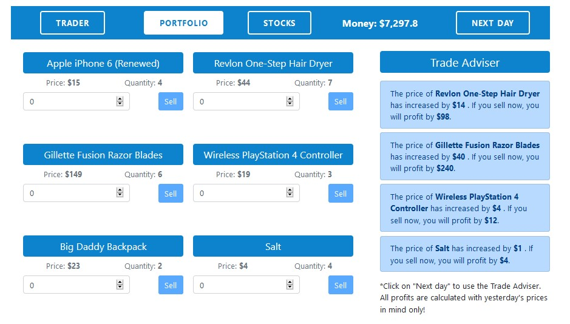
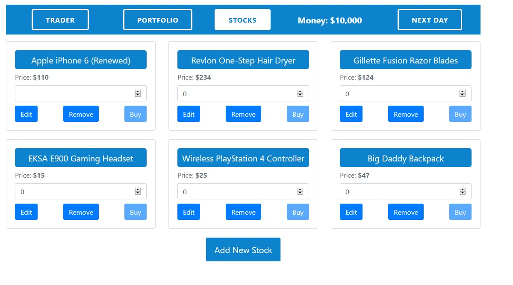
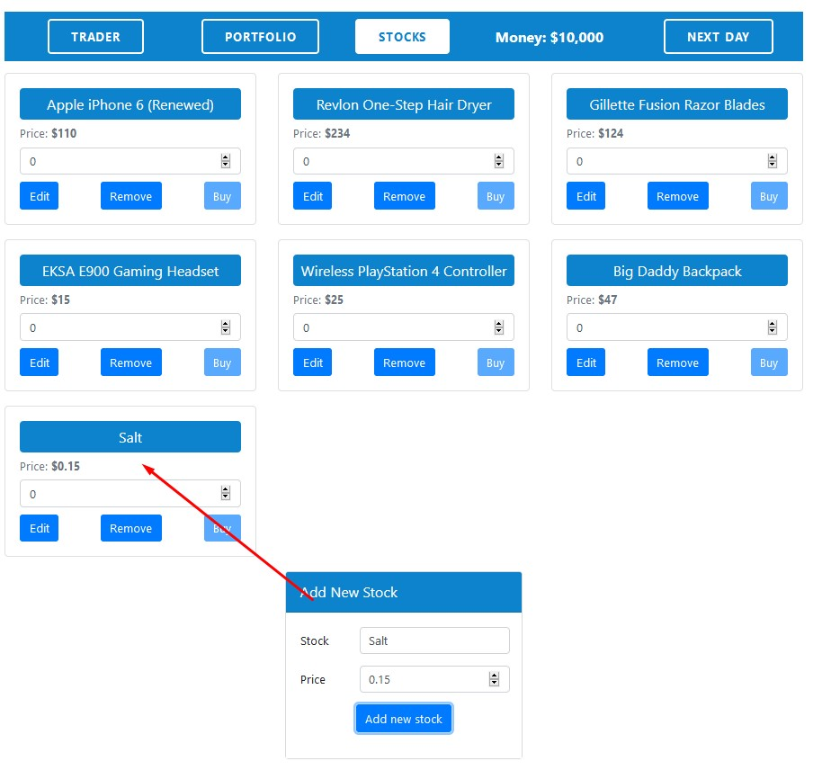
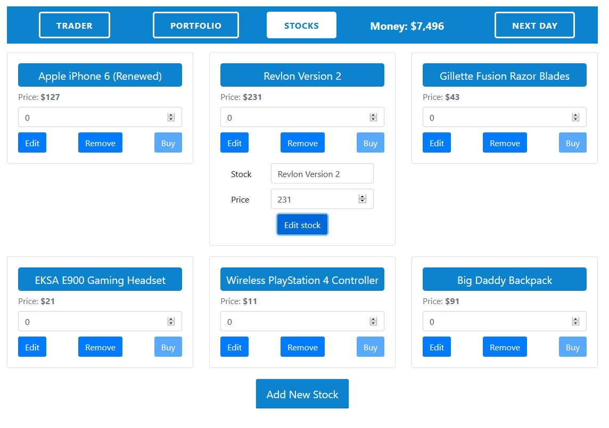

# Stock Trader

### A VueJS application for trading stocks, using a central Vuex store. You can add new stock, edit, delete, purchase and sell stocks. Stock prices change every day and you have a Trade Advisor to notify you when a stock in your portfolio has increased in price. You can also see the profit should you decide to sell particular stocks.

## Portfolio section

## Stocks section

## Add new stock menu

## Edit an existing stock section

